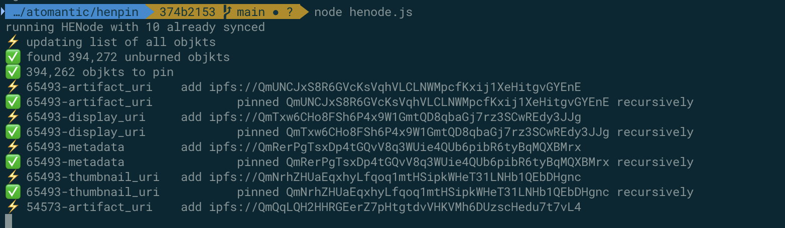

# hěn pīn 狠拼 (very together, much backup)

A H=N IPFS pinning tool.

## IPFS Pinning

Hic et Nunc (like most NFT platforms) stored the NFT data on IPFS. This is a network of decentralized file hosts. Every computer running an IPFS node is an edge caching server for the network as well as a host for specific (pinned) files. You can run your own website from IPFS if you like :)

There's a caveat with IPFS: If nobody is pinning a piece of content, it can expire from the network and be lost.

You can backup the Hic et Nunc platform (or just your own creations and collection, or that of your friends) by running an IPFS node and pinning the associated content.

This is a tool for pinning all of the creations and collections of a given tezos wallet.

1. Install and run IPFS: https://ipfs.io/#install
2. Git Clone this repository or download the release zip file
3. Make sure you have Node.js installed: http://nodejs.org
4. run `npm i` to install node modules
5. Pin collection/creations by wallet address:

```
node pin.js tz1iyFi4WjSttoja7Vi1EJYMEKKSebQyMkF9
```

or edit `pin.sh` to add your own addresses and run like so:

```
./pin.sh
```

### Timeout Config

There is a default timeout on IPFS pin set to 60 seconds in `./config.js`. You can override this value by setting the `IPFS_PIN_TIMEOUT` env var to an arbitrary value like so:

> Example setting timeout to 1 second:

```
IPFS_PIN_TIMEOUT=1s node pin.js tz1iyFi4WjSttoja7Vi1EJYMEKKSebQyMkF9

# OR

IPFS_PIN_TIMEOUT=1s ./pin.sh
```

## HENode

You can fun a full node of all H=N published assets by running

```
node henode.js
```

This will keep track of which files have already succesfully pinnned in a local state file (`.state.json`) and will resume from there on restarts.



## Unpin Everything and Start Over?

You can `reset` your ipfs pins (unpin everything) like so:

```
ipfs pin ls --type recursive | cut -d' ' -f1 | xargs -n1 ipfs pin rm
ipfs repo gc
```

## Under the Hood

this repo created by Adam Eivy @antic - https://tryshowtime.com/antic

Much thanks, very wow goes to https://hicdex.com/ (the underlying query api) by @marchingsquare - https://www.hicetnunc.xyz/marchingsquare
